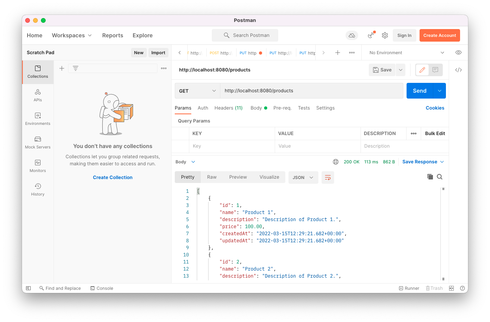
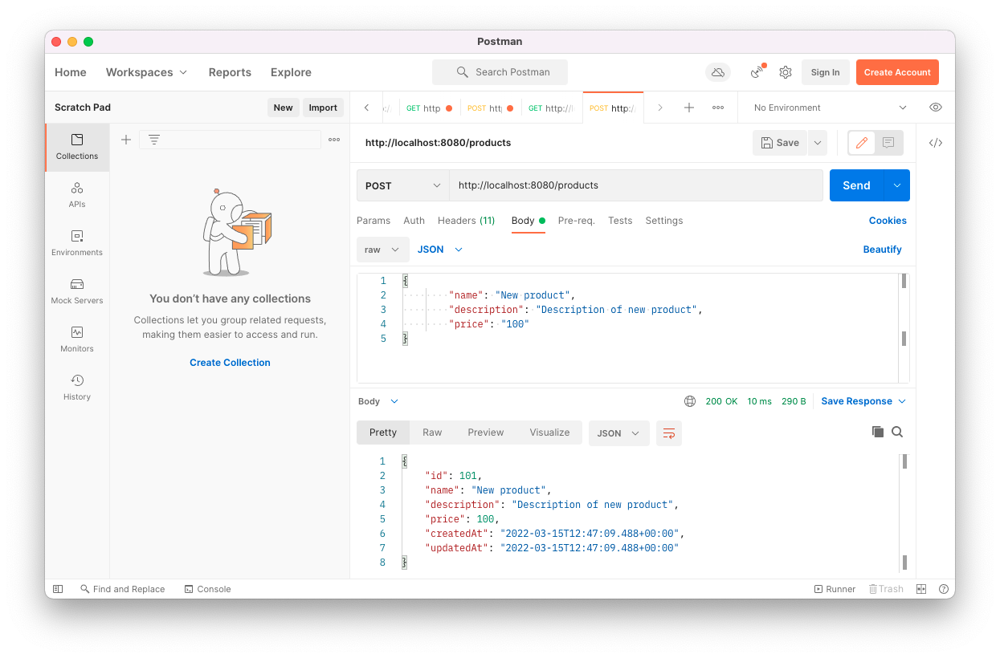
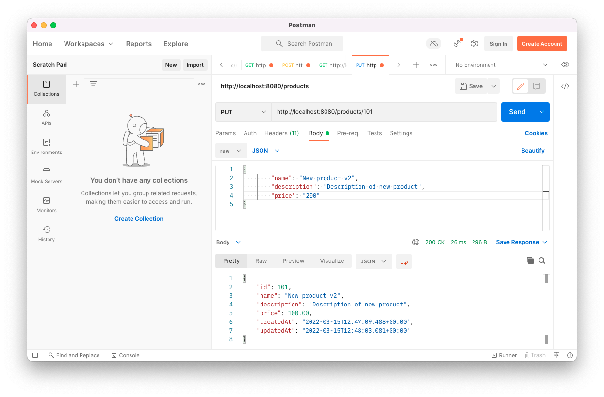
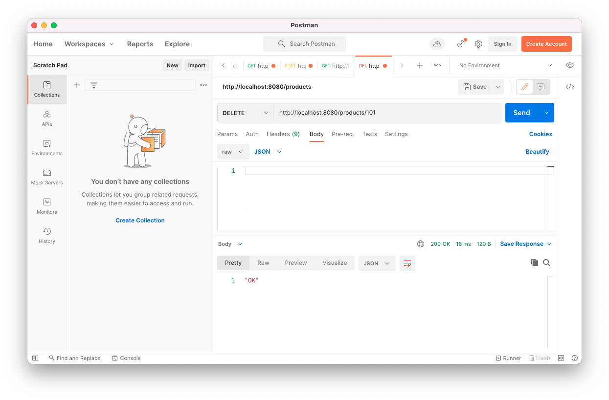
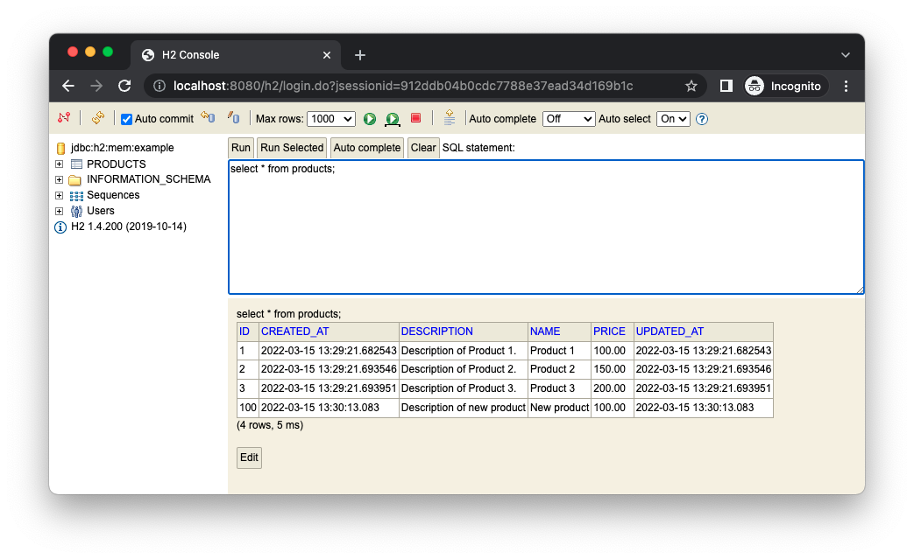

# springboot-restapi
Spring boot application exposing CRUD REST-API for products database.

## Table of contents
* [General info](#general-info)
* [Technologies](#technologies)
* [Features](#features)
* [Setup](#setup)
* [Status](#status)
* [License](#license)

## General info
Goal of project is to create spring boot rest api.

## Technologies
* [Official Apache Maven documentation](https://maven.apache.org/guides/index.html)
* [Spring Boot Maven Plugin Reference Guide](https://docs.spring.io/spring-boot/docs/2.6.4/maven-plugin/reference/html/)
* [Spring Web](https://docs.spring.io/spring-boot/docs/2.6.4/reference/htmlsingle/#boot-features-developing-web-applications)* [JPA](https://spring.io/projects/spring-data-jpa)
* [Hibernate](https://hibernate.org/)
* [H2 Embedded Database](https://www.h2database.com)
* [Postman](https://www.postman.com/)

## Features
[What is REST?](https://www.codecademy.com/article/what-is-rest)

There are 4 basic HTTP verbs we use in requests to interact with resources in a REST system:
* GET — retrieve a specific resource (by id) or a collection of products
* POST — create a new resource
* PUT — update a specific resource (by id)
* DELETE — remove a specific resource by id

## Setup
How to run this project.

1. Clone this repo

2. To run, go to project folder and run

```mvn package```

4. Run application

```mvn spring-boot:run```

5. Use postman to interact with REST api





6. Alternatively you can use curl command:
* get all products
```
curl --location --request GET 'http://localhost:8080/products'
```

* get product by id
```
curl --location --request GET 'http://localhost:8080/products/101'
```

* create products:
```
curl --location --request POST 'http://localhost:8080/products' \
--header 'Content-Type: application/json' \
--data-raw '{
        "name": "New product",
        "description": "Description of new product",
        "price": "100"
}'
```

* update product:
```
curl --location --request PUT 'http://localhost:8080/products/101' \
  --header 'Content-Type: application/json' \
  --data-raw '{
  "name": "New product v2",
  "description": "Description of new product",
  "price": "200"
  }'
```

* delete product:
```
curl --location --request DELETE 'http://localhost:8080/products/101' \
--header 'Content-Type: application/json'
```

8. You can check data in memory database using [h2-console](http://localhost:8080/h2)


## Status
Project is finished.

## License
MIT